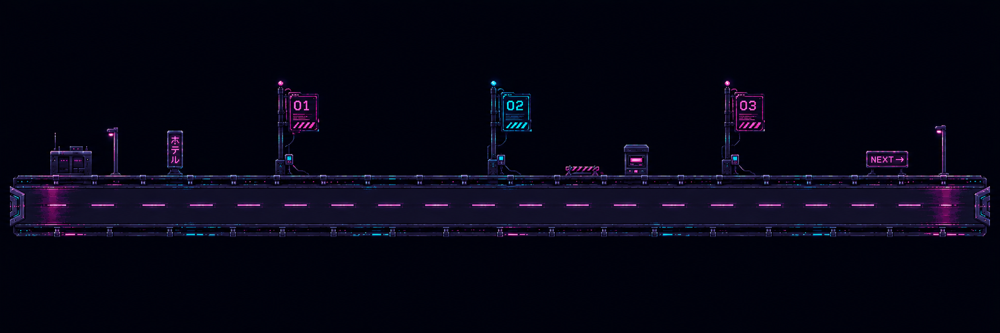

# Developer guide

This guide explains the portfolio as it exists now. It assumes you know basic HTML and CSS but may be new to JavaScript, browser state, and WebGL.

## 1. The mental model

There is one set of portfolio content in `index.html` and two ways to navigate it:

- **Spatial mode** projects the four section panels into a WebGL gallery and moves a virtual camera between them.
- **2D mode** places the same four panels in one vertical document and scrolls between them.

The content is not duplicated. A Work heading, project tile, or skill exists once in the HTML, and both modes render that same element. This prevents the two versions from drifting apart.

The site has no framework, package manager, compilation, or build output. The browser loads ordinary HTML, CSS, and JavaScript directly.

## 2. Repository map

| File or folder | Purpose |
| --- | --- |
| `index.html` | Primary page structure, content, navigation, accessibility labels, and asset references |
| `styles.css` | Theme, all component layouts, responsive behavior, 2D stacking, and projected-panel presentation |
| `script.js` | Application state, navigation, mode switching, history, focus, Work beacons, and Skills tabs |
| `scene.js` | Dependency-free WebGL scene, camera stops, route interpolation, and panel projection data |
| `assets/` | Logos, road art, animated Kirbs, résumé PDF, favicon, and social artwork |
| `projects/` | Retained standalone case-study routes; these do not power the project tiles on the main page |
| `tools/serve.*` | Local static servers |
| `tools/validate.*` | Static validation for routes, references, IDs, ARIA targets, JSON, XML, and architecture |
| `.github/workflows/deploy-pages.yml` | GitHub Pages validation, staging, and deployment |
| `vercel.json` | Optional Vercel routes and security headers |

## 3. Run and validate

### Windows

Open PowerShell in the repository and run:

```powershell
powershell.exe -NoProfile -ExecutionPolicy Bypass -File .\tools\serve.ps1
```

Then open <http://127.0.0.1:4173/>. Keep that PowerShell window open. Press `Ctrl+C` to stop it.

Run validation with:

```powershell
powershell.exe -NoProfile -ExecutionPolicy Bypass -File .\tools\validate.ps1
```

### macOS or Linux

```sh
./tools/serve.sh
./tools/validate.sh
```

The server matters because clean URLs, browser history, and standalone project folders behave more reliably over HTTP than through a `file:///` URL.

## 4. How `index.html` is organized

The important top-level pieces are:

```text
body
├── shared SVG filters
├── skip link
├── WebGL canvas and atmosphere
├── entrance gate
└── .experience
    ├── identity sidebar
    ├── section navigation
    ├── status UI
    ├── main portfolio
    │   ├── #work
    │   ├── #projects
    │   ├── #skills
    │   └── #education
    ├── Previous / Next section controls
    └── mode and motion controls
```

Each main section uses this pattern:

```html
<section class="content-panel ..." id="work" data-section="work" aria-labelledby="work-title">
  <div class="panel-teaser" aria-hidden="true">...</div>
  <div class="panel-scroll">
    <div class="panel-header">...</div>
    <h2 id="work-title" class="sr-only" tabindex="-1">Work Experience</h2>
    <!-- Section content -->
  </div>
</section>
```

The `id`, `data-section`, navigation link, `aria-labelledby`, and heading ID must agree. `script.js` uses those values to navigate and focus the new section. The validator catches missing ARIA targets and duplicate IDs.

The `panel-teaser` is the abbreviated label visible when a spatial panel is in the distance. It is hidden from assistive technology because the real section content supplies the meaningful text.

## 5. Theme and typography

The main theme controls are at the top of `styles.css`:

```css
:root {
  --background-color: #020307;
  --background-color-raised: #07070c;
  --surface-color: rgba(5, 5, 10, 0.88);
  --accent-rgb: 199, 21, 133;
  --accent-color: rgb(var(--accent-rgb));
  --primary-color: var(--accent-color);
  --primary-color-hover: var(--accent-color);
  --primary-color-focus: var(--accent-color);
  --secondary-color: var(--accent-color);
  --secondary-color-muted: var(--accent-color);
  --tertiary-color: var(--accent-color);
  --text-color-all: #ffffff;
  --font-ui: ...;
}
```

Change `--accent-rgb` to recolor translucent glows that need individual red, green, and blue channels. Change the semantic color variables if you want primary, secondary, and tertiary accents to differ.

The final universal text-color rule keeps all interface text white. Component color declarations remain useful for structure and `currentColor`, but the universal rule intentionally wins for text.

`--font-ui` uses Fixedsys-style fonts first and falls back through installed monospace fonts. No webfont is downloaded, so the exact glyph shape depends on which font is available on the visitor's device.

## 6. Panel dimensions and 2D/3D parity

Spatial sizing begins with constants near the top of `scene.js`:

```js
var PANEL_VIEWPORT_WIDTH_RATIO = 0.75;
var PANEL_VIEWPORT_HEIGHT_RATIO = 0.75;
var PANEL_MAX_ASPECT_RATIO = 2;
var PANEL_SOURCE_HEIGHT = 700;
```

The focused panel is approximately 75% of the viewport width and 75% of its height. Width is capped at twice the height. Content is laid out on a 700-pixel logical canvas and then scaled to the physical panel.

`sync2dPanelGeometry()` in `script.js` repeats the same calculation for 2D mode. It writes these CSS custom properties on the body:

- `--linear-panel-width`
- `--linear-panel-height`
- `--linear-panel-source-width`
- `--linear-panel-source-height`
- `--linear-panel-scale`
- `--linear-panel-edge-space`
- `--linear-panel-gap`

The `.has-2d-panel-layout` rules in `styles.css` use those values to give every 2D section the same content dimensions, wrapping, and spacing as its focused spatial counterpart. The difference is only the outer navigation mechanism: projection/camera movement versus vertical stacking/scrolling.

If you change the viewport ratios, update the constants in `scene.js` and the matching `0.75` calculations in `sync2dPanelGeometry()`. Changing only one side will make the two modes diverge.

## 7. Editing each section

### Work experience

The road is an ordinary image:

```html

```

The dark background baked into the image is converted to transparency by the `road-dark-to-alpha` SVG filter defined near the start of `index.html` and applied in CSS.

Each beacon is one `<li data-work-stop>` containing a trigger and its panel:

```html
<li class="work-stop work-stop--apple" data-work-stop data-work-company="Apple">
  <button data-work-stop-trigger aria-expanded="false" aria-controls="work-stop-apple-panel">...</button>
  <section id="work-stop-apple-panel" data-work-stop-panel hidden>...</section>
</li>
```

`bindWorkStops()` attaches the click handlers. `setWorkStop()` synchronizes `hidden`, `inert`, `aria-hidden`, and `aria-expanded`, then animates the panel when motion is allowed. Opening one beacon does not close another; each panel closes only through its own X button.

Horizontal stop placement is controlled by the modifier rules for `.work-stop--apple`, `.work-stop--meta`, and `.work-stop--suggestions`. Tesla uses the base position. Panel width and direction are controlled by `.work-stop__panel`; the panels are right-aligned so they open toward the left of their posts.

The Kirbs GIF already contains its character animation. CSS animates `.work-timeline__kirbs-track` horizontally so the entire image travels across the road. Reduced motion disables that travel.

To add a work stop:

1. Copy a complete existing `<li data-work-stop>`.
2. Give the panel a unique ID.
3. Put that same ID in the trigger's `aria-controls`.
4. Give the `<h3>` a unique ID and use it in the panel's `aria-labelledby`.
5. Add a modifier rule to position the stop over the correct post.

### Projects

Projects are eight static `.project-tile` articles in one `.project-directory__grid`. A tile contains only a title, summary, skill chips, and optionally a real external link:

```html
<article class="project-tile">
  <div class="project-tile__content">
    <h3>Project name</h3>
    <p>Short summary.</p>
    <ul class="project-tile__skills" aria-label="Project name skills">
      <li>Technology</li>
    </ul>
    <a class="project-tile__link" href="https://...">Visit project</a>
  </div>
</article>
```

There is no project-card flip interaction, expandable detail area, or in-page case-study dialog. The folders under `projects/` are retained standalone URLs and are independent of the eight main-page tiles.

To add or replace a tile, edit one complete article. Keep project names in real `<h3>` elements and skill chips inside a real `<ul>`. Use `target="_blank" rel="noopener noreferrer"` for an external destination. Do not add a fake link when no destination exists.

The desktop grid uses eight logical columns and two rows; each tile spans two columns, producing four tiles per row. Container queries switch to two columns and then one column when the panel itself becomes narrow.

### Skills

The Skills section has three selector buttons and three matching pages: Interface, Systems, and Delivery. A selector's `data-skill-page-select`, `aria-controls`, target page ID, and page's `data-skill-page-index` must match.

Each skill is a non-clickable list item:

```html
<li class="skill-item skill-item--primary" data-skill-node="javascript">
  <div class="skill-item__control">
    <span class="skill-item__mark" aria-hidden="true">
      
    </span>
    <span class="skill-item__copy">
      <strong>JavaScript</strong>
      <small>Interface language</small>
    </span>
  </div>
</li>
```

`skill-item--primary` makes a root or especially important technology more visually prominent. `skill-item--tertiary` uses the tertiary accent. The base class is the middle treatment.

The `data-skill-node` value is mainly a stable styling hook for logos that need special filtering. For example, dark Rust, Kafka, and Flask artwork is inverted for the dark background. If a new logo already looks correct, it needs no special CSS rule.

`updateSkillPages()` keeps exactly one skill page visible, updates the layer counter and selector state, and announces the selected layer. The containing stage also accepts Up and Down arrow keys.

### Education

Both schools use the same `.education-meta` layout: logo on the left, two-column details on the right. Course and organization chips use `.tag-region` and `.tags`.

The Cal and Peking logos are recolored by SVG filters in `index.html`. The Cal-specific filter selects the original gold outline before applying the accent, which preserves its transparent interior. The Peking filter recolors its full alpha mask.

Education is a single page. There is no pager, page counter, or nested arrow navigation.

## 8. JavaScript application state

`script.js` is wrapped in an immediately invoked function expression:

```js
(function () {
  'use strict';
  // application code
})();
```

This keeps variables such as `state` and `sceneController` out of the global browser scope.

The main `state` fields are:

| Field | Meaning |
| --- | --- |
| `entered` | Whether the entrance gate has been left |
| `active` | Section represented by navigation and URL state |
| `settled` | Section at which spatial travel has completed |
| `displayed` | Section currently receiving full projected detail |
| `mode` | `"3d"` or `"2d"` |
| `reducedMotion` | Whether optional animation is suppressed |
| `phase` | Gate, entry, idle, or transition state |
| `transitionId` | Invalidates callbacks from an older interrupted transition |
| `sceneRetryNeeded` | Whether spatial mode can be retried after context loss |
| `selectedSkillPage` | Current Skills layer index |

Important functions:

- `boot()` prepares the semantic shell, preferences, event handlers, clock, and lazy scene load.
- `bindEvents()` connects navigation, controls, history, wheel, touch, Work stops, and Skills tabs.
- `goToSection()` is the shared navigation entry point. In 2D it scrolls; in 3D it starts camera travel.
- `showSection()` keeps every primary section available in 2D but only the relevant panel interactive in 3D.
- `updateInterface()` updates current navigation, button limits, labels, counters, and document title.
- `setMode()` changes presentation without replacing the content.
- `handleHistory()` restores mode and section when the browser Back or Forward button is used.
- `applyMotionPreference()` synchronizes CSS, the motion button, and the scene controller.

Section order is defined once near the top:

```js
var SECTIONS = ['work', 'projects', 'skills', 'education'];
```

If you add or reorder a primary section, update this array, the navigation HTML, section numbers, and the matching camera stop/order in `scene.js`.

## 9. Spatial scene and camera movement

`scene.js` creates a raw WebGL scene without Three.js or another library. It draws the grid, rails, fragments, and entrance frames. It does not draw the readable content; the browser projects the real HTML panels over the canvas.

Each item in `STOPS` defines a camera position, target, panel frame position, yaw, and size. `ORDER` defines the route through the four sections.

During motion, the scene controller reports projected panel corner coordinates through `onProjection`. `applySceneProjection()` in `script.js` converts those four corners into a CSS matrix and applies it to the corresponding HTML panel. At the focused stop, `applyNativeFocusedPanel()` removes perspective distortion and uses a sharp axis-aligned layout, which is why final text is clearer than text rendered continuously through a transformed texture.

Forward and reverse travel use the same route with opposite interpolation. The camera keeps looking toward the panels rather than turning around, so reverse navigation feels like walking backward.

`scene.js` is loaded dynamically from `script.js`. Keep it out of a static `<script src="scene.js">` tag: failure to initialize WebGL must not block the semantic portfolio or 2D fallback.

## 10. Reduced motion

Reduced motion may come from the operating system or the user's Motion button. `applyMotionPreference()` adds the `reduce-motion` body class and tells the scene controller.

In spatial navigation, reduced motion is treated as an atomic state change. `goToSection()` commits the active panel and camera stop together instead of starting a zero-duration transition. If reduced motion is enabled during travel, the scene completes the pending destination before drawing its final idle frame. This ordering avoids stale, dim, or slanted panels.

When adding animation:

1. Provide a useful static end state.
2. Disable or shorten it under both `@media (prefers-reduced-motion: reduce)` and `body.reduce-motion` when appropriate.
3. Do not use animation completion as the only way to update required application state.

## 11. Accessibility rules worth preserving

- Keep semantic headings even when they are visually hidden with `.sr-only`.
- Keep `aria-labelledby`, `aria-controls`, and their target IDs synchronized.
- Use `hidden` for content that should not be presented and `inert` for content that must not receive interaction.
- Decorative images use `alt=""`; meaningful image information needs a real text alternative.
- Current navigation uses `aria-current="page"`, so its visual highlight also has a screen-reader meaning.
- Disabled Previous/Next controls mark real boundaries in spatial mode. They are hidden in 2D because scrolling is the navigation mechanism.
- External links that open a new tab include both `rel="noopener noreferrer"` and screen-reader-only notice text.
- Do not remove the live region; it announces section and skill-layer changes.

## 12. Common editing recipes

### Change the email address

Search `index.html` for `mailto:`. There is one sidebar email action and one Work suggestions email action.

### Replace the résumé

Replace `assets/joying_resume.pdf` while keeping the filename, or update the sidebar link's `href` and `download` attributes together.

### Change a project

Edit its `.project-tile` article in `index.html`: heading, paragraph, skill list, and optional real destination. No JavaScript change is required.

### Add a skill

Copy one complete `.skill-item`, update its `data-skill-node`, image path and intrinsic dimensions, name, and category. Put it inside the correct skill page. Add a logo-specific CSS filter only if the image is unreadable on the dark background.

### Change panel content size

First change component typography or spacing in `styles.css`; both modes share it. Do not add a 2D-only font size unless you intentionally want visual divergence. Change the global 75% panel geometry only when you want every section in both modes to change.

### Change the mode labels or section names

Update visible navigation text in `index.html` and `LABELS` in `script.js`. Keep `SECTIONS`, link `data-section-link`, section `data-section`, IDs, and hashes consistent.

## 13. No-JavaScript behavior

The root `<html>` starts with `class="no-js"`. `boot()` replaces it with `js` immediately. If JavaScript is unavailable, the `html.no-js` CSS hides interactive chrome and shows the portfolio as a normal readable document. This is why meaningful content should remain in HTML rather than being generated only by JavaScript.

## 14. Deployment and final checks

The GitHub Pages workflow:

1. checks out the repository;
2. runs `tools/validate.py`;
3. stages public files into `_site`;
4. validates the staged site again;
5. uploads and deploys the artifact.

Before publishing a visual change:

1. Run the validator.
2. Open both 3D and 2D modes.
3. Navigate forward and backward through all four sections.
4. Test Full and Reduced motion.
5. Open every Work beacon and close each with its X.
6. Switch through all three Skills tabs with mouse and keyboard.
7. Check a desktop landscape size, a portrait tablet size, and a phone size.
8. Open each retained `/projects/.../` route directly if you changed shared case-study styles.
9. Confirm there are no browser-console errors or missing asset requests.

## 15. Troubleshooting

### `localhost:4173` does not load

The server process is not running, exited with an error, or another program owns the port. Start `tools/serve.ps1` again and keep its window open. If necessary, use `-Port 4174` and open that port instead.

### A section is dim, slanted, or not interactive after navigation

Check `state.active`, `state.settled`, and `state.displayed`, then verify that `showSection()` ran after the camera completion. Also test Reduced motion because it deliberately uses a separate atomic navigation branch.

### 2D and 3D wrap text differently

Look for a mode-specific component rule. Shared component styles should be mode-neutral; only outer stacking and navigation mechanics should differ. Also confirm that `sync2dPanelGeometry()` is still using the same ratios and 700-pixel source height as `scene.js`.

### A Skills tab is blank

Confirm that its selector index matches the target page's `data-skill-page-index`, that `aria-controls` names the page ID, and that only the selected page lacks `hidden`.

### Validation reports a missing ARIA target

An attribute such as `aria-labelledby="example-title"` points to an ID that does not exist in the same HTML document. Restore the target or update both values together; do not silence the validator.
